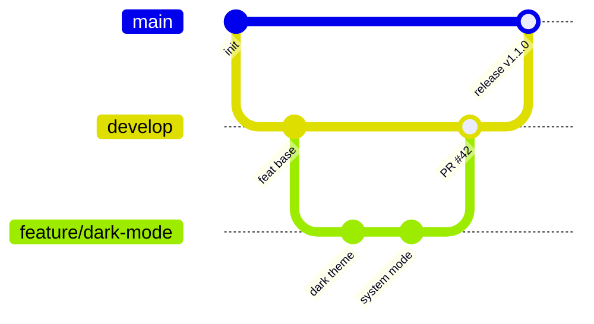

# Git & GitHub Workflow Guide

Step-by-step commands for running TaskFlow Hub as a professional open-source project. Replace placeholders:

| Placeholder | Example |
|-------------|---------|
| `YOUR_USERNAME` | `johndoe` |
| `COLLABORATOR` | `janedoe` |
| `COLLABORATOR_EMAIL` | `jane@users.noreply.github.com` |

---

## Phase 1 — Local repository setup

### 1.1 Initialize Git (if not already done)

```bash
cd taskflow-hub
git init
git branch -M main
```

### 1.2 First commit on `main`

```bash
git add .
git commit -m "chore: initial Flutter project scaffold"
```

### 1.3 Create `develop` integration branch

```bash
git checkout -b develop
git push -u origin develop   # after remote is added
```

### 1.4 Recommended default branch on GitHub

In **Settings → General → Default branch**, set `develop` for day-to-day integration, or keep `main` and merge release PRs only. Document your choice in README.

---

## Phase 2 — Connect to GitHub

### 2.1 Create empty repository on GitHub

Use the web UI or:

```bash
gh repo create YOUR_USERNAME/taskflow-hub --public --source=. --remote=origin
```

### 2.2 Push branches

```bash
git checkout main
git push -u origin main

git checkout develop
git push -u origin develop
```

---

## Phase 3 — Feature branch workflow (example)

This walkthrough implements **Issue #1: dark mode** (see [SAMPLE_ISSUES.md](SAMPLE_ISSUES.md)).

### 3.1 Start from latest `develop`

```bash
git checkout develop
git pull origin develop
```

### 3.2 Create feature branch

```bash
git checkout -b feature/dark-mode
```

### 3.3 Make incremental commits

```bash
# ... edit lib/core/theme/app_theme.dart ...
git add lib/core/theme/app_theme.dart
git commit -m "feat(theme): add dark color scheme"

# ... edit lib/app.dart ...
git add lib/app.dart
git commit -m "feat(theme): respect system theme mode"
```

### 3.4 Push feature branch

```bash
git push -u origin feature/dark-mode
```

### 3.5 Open pull request into `develop`

```bash
gh pr create \
  --base develop \
  --head feature/dark-mode \
  --title "feat: add dark mode theme support" \
  --body "Closes #1"
```

Or use GitHub UI: **Compare & pull request** → base `develop` → fill PR template.

### 3.6 Wait for CI

GitHub Actions runs:

- `flutter analyze`
- `dart format` check
- `flutter test`
- `flutter build apk` + `flutter build web`

Fix failures locally:

```bash
dart format .
flutter analyze --fatal-infos
flutter test
git add .
git commit -m "fix: address CI analyze warnings"
git push
```

### 3.7 Code review and merge

```bash
# Reviewer approves on GitHub, then:
gh pr merge --squash --delete-branch
```

Squash merge keeps `develop` history readable. Use **merge commit** if you want to preserve every commit from the feature branch.

### 3.8 Sync local branches

```bash
git checkout develop
git pull origin develop
git branch -d feature/dark-mode
```

### 3.9 Release to `main` (when ready)

```bash
git checkout main
git pull origin main
git merge --no-ff develop -m "release: v1.1.0 dark mode"
git tag -a v1.1.0 -m "Dark mode support"
git push origin main --tags
```

---

## Phase 4 — Issue lifecycle

### 4.1 Open an issue

```bash
gh issue create \
  --title "Add dark mode theme" \
  --body "See docs/SAMPLE_ISSUES.md#issue-1-add-dark-mode-theme" \
  --label "enhancement" \
  --label "good first issue"
```

Note the issue number (e.g. `#1`).

### 4.2 Link issue in branch/PR

Reference `Closes #1` in the PR body. GitHub auto-closes the issue when the PR merges.

### 4.3 Close manually (if needed)

```bash
gh issue close 1 --comment "Fixed in #42"
```

---

## Phase 5 — Bug fix workflow

```bash
git checkout develop
git pull origin develop
git checkout -b fix/validation-feedback

# ... fix code ...
git add .
git commit -m "fix: show inline validation for empty task title"
git push -u origin fix/validation-feedback

gh pr create --base develop --title "fix: validation feedback on task form" --body "Closes #4"
```

---

## Phase 6 — Add a real collaborator

Collaborators must be **real people** you work with — not fake accounts for badge farming.

### 6.1 Invite via GitHub UI

1. Repository → **Settings** → **Collaborators**
2. Click **Add people**
3. Enter their GitHub username
4. They accept the email invitation

### 6.2 Invite via CLI (admin)

```bash
gh api repos/YOUR_USERNAME/taskflow-hub/collaborators/COLLABORATOR -X PUT -f permission=push
```

Permissions: `pull`, `push`, `admin`, `maintain`, `triage`.

### 6.3 Collaborator workflow

```bash
# Collaborator forks or clones with write access
git clone https://github.com/YOUR_USERNAME/taskflow-hub.git
cd taskflow-hub
git checkout develop
git checkout -b feature/export-json
# ... work, commit, push ...
gh pr create --base develop
```

---

## Phase 7 — Co-authored commits

Credit multiple authors when pair programming or integrating substantial review feedback.

### 7.1 Commit with co-author trailer

```bash
git commit -m "feat: add JSON export use case

Implements ExportTasks and share action.

Co-authored-by: Jane Doe <COLLABORATOR_EMAIL>"
```

**Important:** The co-author email must match a verified GitHub email (check **Settings → Emails**).

### 7.2 Add co-author in interactive commit (optional)

```bash
git commit
# In the editor, add a blank line and:
# Co-authored-by: Jane Doe <jane@users.noreply.github.com>
```

### 7.3 Verify on GitHub

After push, the commit shows multiple avatars on the commit detail page.

---

## Phase 8 — Protect branches (recommended)

On GitHub: **Settings → Branches → Add branch protection rule**

For `main` and `develop`:

- [x] Require a pull request before merging
- [x] Require status checks to pass (`analyze`, `test`, `build`)
- [x] Require branches to be up to date
- [x] Do not allow bypassing (optional for solo maintainers)

---

## Phase 9 — Useful daily commands

```bash
# Status and history
git status
git log --oneline --graph --all -20

# Update feature branch with latest develop
git checkout feature/my-feature
git fetch origin
git rebase origin/develop

# Stash WIP changes
git stash push -m "wip dark mode"
git stash pop

# Run full local CI
dart format --output=none --set-exit-if-changed .
flutter analyze --fatal-infos
flutter test
flutter build apk --release
```

---

## Ethics — legitimate open-source activity

GitHub profile achievements and contribution graphs reflect **real collaboration**:

| Do | Don't |
|----|-------|
| Ship features users need | Open/close fake issues |
| Write tests and docs | Mass empty commits |
| Review PRs thoughtfully | Use sock-puppet collaborators |
| Fix bugs reported by users | Automate meaningless PR merges |

Sustainable reputation comes from maintained projects and helpful reviews, not metric manipulation.

---

## Quick reference — branch flow


